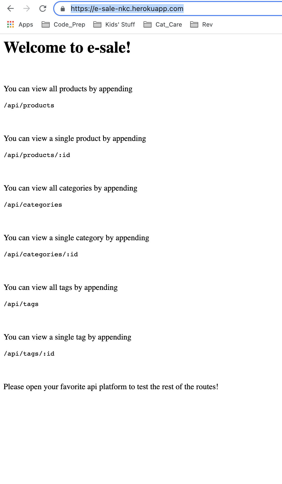

# e-sale

This is an ecommerce platform backend, designed to be hooked up to the frontend of a product management system.
    
I learned A LOT about routes from this project. I also learned how to make my peace with Sequelize. It would have been a lot of fun to hook up a frontend to this, just to have a completed application, and eliminating the need to the use of multiple programs in order to test/interact with it, but the time for that will come.

## Table of Contents
* [Installation](#installation)
* [Instructions for Use](#instructions-for-use)

* [License](#license)
    
## Installation
1. This program requires the following programs be installed:<ul><li>Node.js</li><li>nodemon (I prefer)</li><li>npm dotenv (to input environmental variables</li><li>npm express</li><li>npm mysql2</li><li>npm sequelize</li><li>API platform for testing (e.g. Insomnia or Postman)</li><li>To run live from Heroku link</li><li>you would only need the API platform</li></ul>

2. Before running this program, please have the following information on hand and / or loaded into your 'asset/images' folder:<ul>none</ul>

## Instructions for Use
<ol><li>Clone repo to local machine, open in code editor, open integrated terminal @ level of `server.js`, run `npm i` to install package dependencies.</li><li>In terminal, log into your mysql db connection and run `source schema.sql;` to establish the database on your local machine.</li><li>Return to the node terminal (either exit mysql or open new terminal at server.js: if you pick this second option, you can return to the db connection to make table queries and see how they change as you interact with the routes). Run `npm start seed` to seed the db.</li><li>Start your server in your node window. Either run `npm run start` if you want to use node, or `nodemon server.js` if you have nodemon installed. I like this second option for the dynamic update.</li><li>You are now ready to test your routes. Open your API editor and create the route requests inside a project folder. You can either follow the file trail from the `routes` folder down the chain, or the paths that you will need if running this application on local are listed below:</li></ol>
- to GET all products: `localhost:3007/api/products`
- to GET product by id: `localhost:3007/api/products/:id`
- to POST new product: `localhost:3007/api/products` >> req.body needs product_name, price, stock, category_id, tagIds (an array of numbers)
- to PUT product by id: `localhost:3007/api/products/:id` >> refer to the post route
- to DELETE product by id: `localhost:3007/api/products/:id`
- to GET all categories: `localhost:3007/api/categories`
- to GET category by id: `localhost:3007/api/categories/:id`
- to POST a new category: `localhost:3007/api/categories`>> req.body needs category_name
- to PUT a category by id: `localhost:3007/api/categories/:id` >> refer to the post route
- to DELETE a category by id: `localhost:3007/api/categories/:id`
- to GET all tags: `localhost:3007/api/tags/`
- to GET a tag by id: `localhost:3007/api/tags/:id`
- to POST a new tag: `localhost:3007/api/tags/` >> req.body needs category_name
- to PUT a tag by id: `localhost:3007/api/tags/:id` >> refer to the post route
- to DELETE a tag by id: `localhost:3007/api/tags/:id`

If you want to just test out the routes from the deployed Heroku link:
<ol><li>navigate to `https://e-sale-nkc.herokuapp.com/`. There, you will see instructions for how to view table data in the browser window. </li><li>To test out the POST, PUT, and DELETE routes, open up your API platform, and create the route requests listed below in a project folder:</li></ol>
    - to GET all products: `https://e-sale-nkc.herokuapp.com/api/products`
    - to GET product by id: `https://e-sale-nkc.herokuapp.com/api/products/:id`
    - to POST new product: `https://e-sale-nkc.herokuapp.com/api/products` >> req.body needs product_name, price, stock, category_id, tagIds (an array of numbers)
    - to PUT product by id: `https://e-sale-nkc.herokuapp.com/api/products/:id` >> refer to the post route
    - to DELETE product by id: `https://e-sale-nkc.herokuapp.com/api/products/:id`
    - to GET all categories: `https://e-sale-nkc.herokuapp.com/api/categories`
    - to GET category by id: `https://e-sale-nkc.herokuapp.com/api/categories/:id`
    - to POST a new category: `https://e-sale-nkc.herokuapp.com/api/categories`>> req.body needs category_name
    - to PUT a category by id: `https://e-sale-nkc.herokuapp.com/api/categories/:id` >> refer to the post route
    - to DELETE a category by id: `https://e-sale-nkc.herokuapp.com/api/categories/:id`
    - to GET all tags: `https://e-sale-nkc.herokuapp.com/api/tags/`
    - to GET a tag by id: `https://e-sale-nkc.herokuapp.com/api/tags/:id`
    - to POST a new tag: `https://e-sale-nkc.herokuapp.com/api/tags/` >> req.body needs category_name
    - to PUT a tag by id: `https://e-sale-nkc.herokuapp.com/api/tags/:id` >> refer to the post route
    - to DELETE a tag by id: `https://e-sale-nkc.herokuapp.com/api/tags/:id`
Here is a [video walkthrough]().

## License
The files in this repository are covered by the [MIT License](https://choosealicense.com/licenses/mit/).
